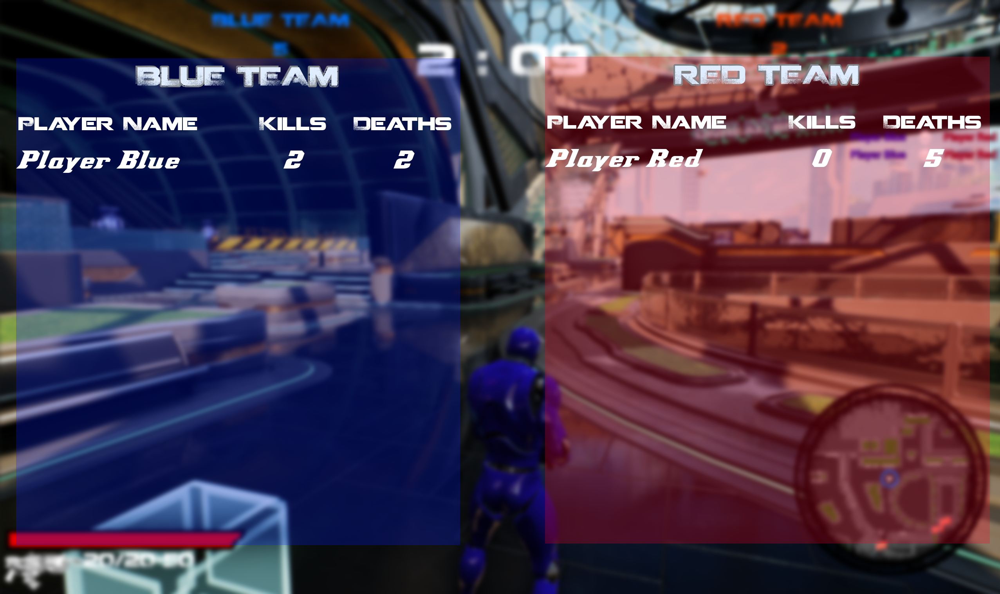

# Mulitplayer TPS

 
Portfolio Link: https://merbistigp.editorx.io/portfolio-mateo/blank-3-3-1-1  

## Introduction
Third Person Multi is a game project made on Unreal Engine 5, focused on Unreal's
Network system.  
The objective was to transition an offline TPS shooter to a Client/Server multiplayer one. 
This project has been made by RABINNE Lenny and ERBISTI Matéo, programming
students at Isart Digital Paris. 
It started on November 2nd 2023, and finished on November 28th 2023. 

## How to open the project
To launch a server open StartDedicatedServer.bat. You can open the .bat file with the
modify option and make sure that the Unreal Engine path matches your own. 
If it’s the first time you're launching the project, you will need to build it (a pop asking you to
do it will appear). 
You can then start adding clients by opening StartClient.bat. Be careful about the
Unreal Engine path in the .bat as for the dedicated server. 
We have made LAN sessions so you must be on the same network as the dedicated server. 

## Game:
The game is a Team Deathmatch that lasts for 5 minutes or stops if one team goes to 20
kills. You either get points by killing a player from another team or if an opponent dies no
matter how. 
There are also AI spawners which you should pay attention to because AI will try to kill you.  
You can interact with AI spawners to spawn friendly AI during a short time that will only hunt players of the other team.  

## Controls:
• WASD: Move 
• Space: Jump 
• LMB: Shoot 
• RMB: Aim 
• E: Interact with buttons 
• F: Punch 
• R: Reload 
• Shift: Sprint 
• TAB: Display Scoreboard 

## Tasks I've worked on:

• Updated player and weapon functionalities to work in multiplayer. 
• Replicated AIs and AI spawners to work on each client. 
• Replicated Health pack and munition spawners. 
• Created lobby and sessions with a dedicated server. 
• Created Kill feed and Leaderboard. 
• Updated the HUD to work on each client.<be>

 
 
 
 
